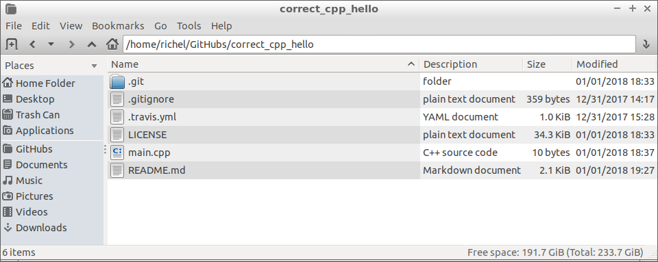

# Do the exercise

After having [cloned your fork](clone_your_fork.md), it is time to [do the exercise](do_the_exercise.md).

Each chapter describes an exercise (in `README.md`) 
and has a file called `main.cpp`. 
`main.cpp` is where you must put your code. 



To do an exercise, edit the `main.cpp` file. 
Usually `main.cpp` contains already some incomplete code to get you started, or dictate some structure. 
For example, the `hello` chapter has this code in `main.cpp`:

```c++
main() {}
```

You can use any editor or IDE to build and run your code. 

Some examples:

 * [Using GCC/`g++` from the command line](do_the_exercise_gcc.md)
 * [Using Qt Creator](do_the_exercise_qt_creator.md)

For some exercises, you will also need to:

 * [run your program with arguments](run_your_program_with_arguments.md).
 * [get 100% code coverage](get_100_percent_code_coverage.md)
 * [get a lower cyclomatic complexity](lower_cyclomatic_complexity.md)

After having [done the exercise](do_the_exercise.md), [push your code](push_your_code.md) to let `git` upload your proposed solution.
